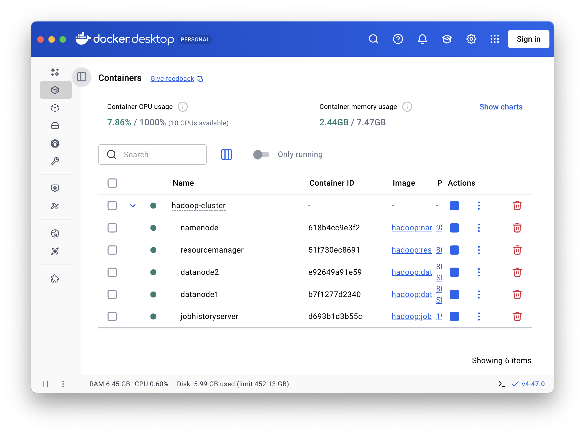
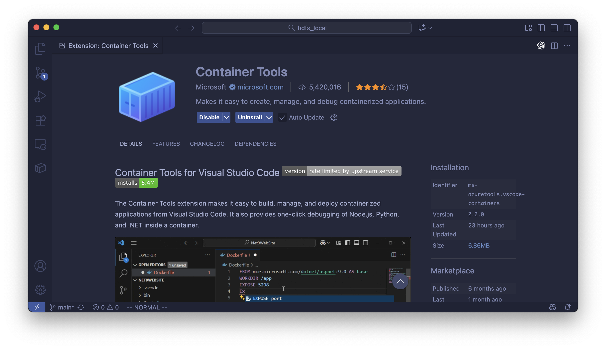
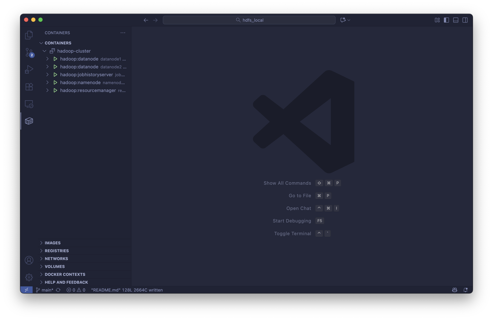
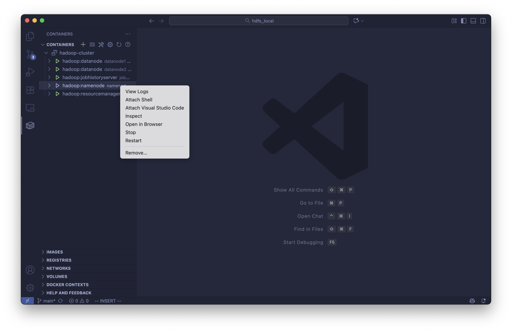

# Building a local hadoop system

Let's build a local hadoop system step by step.

## Docker Installation

Download [docker desktop](https://www.docker.com/) then install.

## Source Mirror


Open docker desktop, in the settings page, search `daemon` and change the settings to content below:

```json
{
    "builder": {
        "gc": {
            "defaultKeepStorage": "20GB",
            "enabled": true
        }
    },
    "experimental": false,
    "registry-mirrors": [
        "https://docker.xuanyuan.me",
        "https://docker.m.daocloud.io",
        "https://docker.xuanyuan.me",
        "https://docker.1ms.run",
        "https://docker.1panel.live",
        "https://hub.rat.dev",
        "https://docker-mirror.aigc2d.com"
    ]
}
```

## Build Images

If you are using mac, run the command below:

```bash
docker buildx build \
    --load \
    --network host \
    -t hadoop:base \
    -f docker/Dockerfiles/Dockerfile.base \
    .

docker buildx build \
    --load \
    --network host \
    -t hadoop:datanode \
    -f docker/Dockerfiles/Dockerfile.datanode \
    .

docker buildx build \
    --load \
    --network host \
    -t hadoop:jobhistoryserver \
    -f docker/Dockerfiles/Dockerfile.jobhistoryserver \
    .

docker buildx build \
    --load \
    --network host \
    -t hadoop:namenode \
    -f docker/Dockerfiles/Dockerfile.namenode \
    .

docker buildx build \
    --load \
    --network host \
    -t hadoop:resourcemanager \
    -f docker/Dockerfiles/Dockerfile.resourcemanager \
    .
```

If you are using windows, run:

```pwsh
docker buildx build `
    --load `
    --network host `
    -t hadoop:base `
    -f docker/Dockerfiles/Dockerfile.base `
    .

docker buildx build `
    --load `
    --network host `
    -t hadoop:datanode `
    -f docker/Dockerfiles/Dockerfile.datanode `
    .

docker buildx build `
    --load `
    --network host `
    -t hadoop:jobhistoryserver `
    -f docker/Dockerfiles/Dockerfile.jobhistoryserver `
    .
docker buildx build `
    --load `
    --network host `
    -t hadoop:namenode `
    -f docker/Dockerfiles/Dockerfile.namenode `
    .

docker buildx build `
    --load `
    --network host `
    -t hadoop:resourcemanager `
    -f docker/Dockerfiles/Dockerfile.resourcemanager `
    .
```

## Build the Cluster

Then compose:

```bash
docker compose up -d
```

To stop the cluster, run:

```bash
docker compose down
```

## Running the Cluster



After running `docker compose down`, open your docker desktop, you can see the nodes are now running in the background.

Click `namenode` and the `Exec` tab, then run:

```
# bash
root@namenode:/opt/hadoop# bash /course487/week4/mini-lab/test.sh
```

To test the functionality. You can safely ignore the warning: `WARN util.NativeCodeLoader: Unable to load native-hadoop library for your platform... using builtin-java classes where applicable`

At the end of the output, you will see the content below if everything works fine:

```
Hadoop  3
Hello   2
MapReduce       2
World   1
a       1
big     1
data    1
framework       1
is      2
powerful        1
processing      1
simplifies      1
```

## Running in Visual Studio Code

First, install the extension `Container Tools`.



After running `docker compose up -d`, you can see a list of running containers in the container tools tab.



Right click on `hadoop:namenode` and select `Attatch Visual Studio Code`:



Then you can run the container in a new vscode window!

## WebUI

Once the cluster is running, you can access the various web interfaces to monitor the status of HDFS and YARN.

-   **NameNode Web UI**: [http://localhost:9870](http://localhost:9870)
    -   Monitor the health and status of the HDFS filesystem.
-   **ResourceManager Web UI**: [http://localhost:8088](http://localhost:8088)
    -   Track applications and resource usage in the YARN cluster.
-   **JobHistoryServer Web UI**: [http://localhost:19888](http://localhost:19888)
    -   View details of completed MapReduce jobs.
-   **DataNode 1 Web UI**: [http://localhost:9864](http://localhost:9864)
-   **DataNode 2 Web UI**: [http://localhost:9865](http://localhost:9865)
-   **NodeManager 1 Web UI (on datanode1)**: [http://localhost:8042](http://localhost:8042)
-   **NodeManager 2 Web UI (on datanode2)**: [http://localhost:8043](http://localhost:8043)
