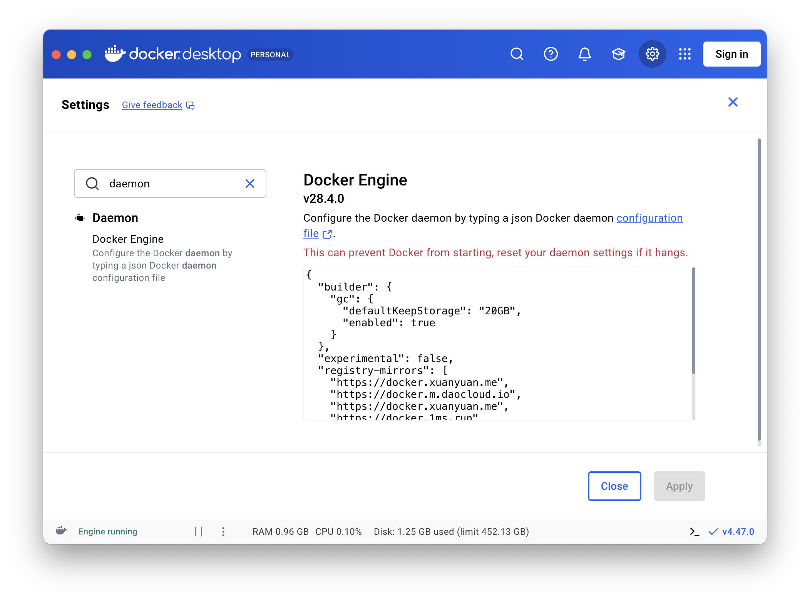

# Building a local hadoop system

Let's build a local hadoop system step by step.

## Docker Installation

Download [docker desktop](https://www.docker.com/) then install.

## Source Mirror



Open docker desktop, in the settings page, search `daemon` and change the settings to content below:

```json
{
    "builder": {
        "gc": {
            "defaultKeepStorage": "20GB",
            "enabled": true
        }
    },
    "experimental": false,
    "registry-mirrors": [
        "https://docker.xuanyuan.me",
        "https://docker.m.daocloud.io",
        "https://docker.xuanyuan.me",
        "https://docker.1ms.run",
        "https://docker.1panel.live",
        "https://hub.rat.dev",
        "https://docker-mirror.aigc2d.com"
    ]
}
```

## Building Images

Run `make all` to build all images.

Run `make base` to build the base image that all nodes and servers depend on.

Run `make clean` to remove build cache.

## Running the Cluster

To run the cluster, run:

```bash
make run-cluster
```

or

```bash
docker compose up -d
```

Then you can enter `namenode` by:

```bash
docker exec -it namenode bash
```

To stop it, run:

```bash
make stop-cluster
```

or

```bash
docker compose down
```

## Testing Cluster Functionality

To test hadoop mapreduce, run:

```bash
container> bash ~/share/examples/hadoop/test.sh
```

To test spark, run:

```bash
container> cd ~/share/examples/spark
container> make all
```

## WebUI

Once the cluster is running, you can access the various web interfaces to monitor the status of HDFS and YARN.

-   **NameNode Web UI**: [http://localhost:9870](http://localhost:9870)
    -   Monitor the health and status of the HDFS filesystem.
-   **ResourceManager Web UI**: [http://localhost:8088](http://localhost:8088)
    -   Track applications and resource usage in the YARN cluster.
-   **JobHistoryServer Web UI**: [http://localhost:19888](http://localhost:19888)
    -   View details of completed MapReduce jobs.
-   **DataNode 1 Web UI**: [http://localhost:9864](http://localhost:9864)
-   **DataNode 2 Web UI**: [http://localhost:9865](http://localhost:9865)
-   **NodeManager 1 Web UI (on datanode1)**: [http://localhost:8042](http://localhost:8042)
-   **NodeManager 2 Web UI (on datanode2)**: [http://localhost:8043](http://localhost:8043)

## Files

The host and the container share same files under the `share` folder.

This behaviour is controlled by `docker-compose.yml`:

```yaml
services:
    namenode:
        volumes:
            - ./share:/root/share
```

Since only `namenode` has this volumes setting, you can only use the `share` folder in `namenode`. If you want to use it in other nodes, add this setting in `docker-compose.yml` and then recompose.
